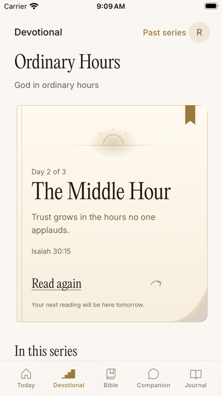
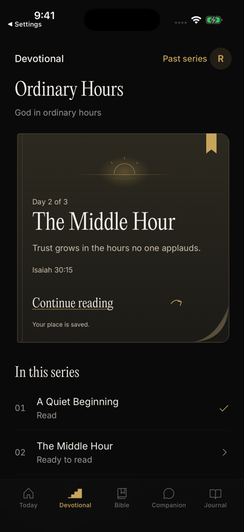
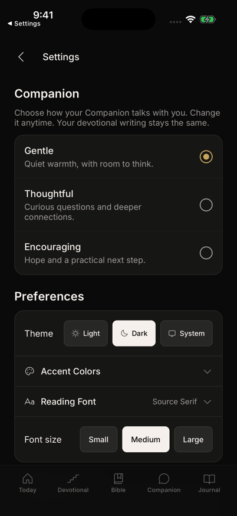
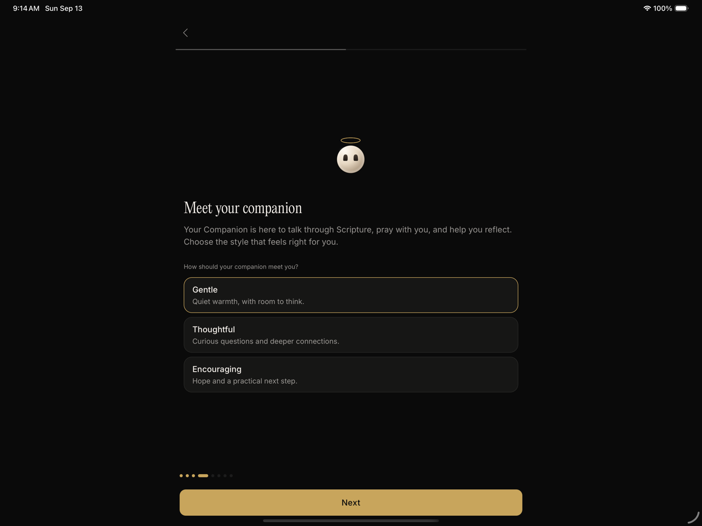

# Companion and Book of Seasons verification

The Devotional tab presents the current reading as a single open page. Its reading affordance includes the folded corner. Completed and calendar-locked days retain their existing gates.

Companion uses warm pearl, one eye pair, and a gold halo. The upright turn uses face parallax and rear occlusion. Thinking splits the body into three small spheres. The spheres move vertically in sequence. Chat keeps a calm idle. Onboarding adds a rare hop and turn.

## Native proof

FlowDeck Release builds ran on iPhone 17 Pro, compact iPhone, and the existing iPad QA simulator. The Pro completed a real chat request. The compact phone opened and left the reader at the largest Dynamic Type size. The iPad rendered the personality choices and upright turn.

Reduced Motion was enabled through iOS Settings. Nine settled avatar captures were pixel-identical over eight seconds. The first frame was excluded because the route was entering.

## Performance boundary

The avatar uses Reanimated transforms and opacity on the UI thread. Static SVG geometry replaces per-frame path rebuilding. Memoization prevents streamed reply text from rerendering the avatar. App background, route focus, and Reduce Motion stop its loops. The extra chat dot animation was removed.

The browser preview measured 119.4 and 120.0 animation callbacks per second during 20-second idle and thinking samples. Both samples had zero long tasks. These are desktop callback measurements. Native simulator recordings and static-render checks do not establish a physical-device frame-rate guarantee.

## Checks

- Full Jest suite: 428 suites passed, 3694 tests passed, one suite/test skipped.
- Final copy and typing-status delta: 6 suites and 31 tests passed.
- Typecheck passed. Lint reported zero errors and existing repository warnings.
- Profile safety passed. Final FlowDeck Release build passed.
- Independent review closed the onboarding draft and motion lifecycle findings.

The new onboarding personality is allowlisted, saved in both draft paths, and restored separately from devotional preferences. Existing names remain compatible. Backend PR46 already deployed request validation and tone instructions on commit 711d405068cda98b5b440b75af308d6fc0e323f0.

Version remains 1.1.11. The Podfile.lock delta changes only ExpoWidgets and Hermes spec checksums after local dependency resolution. Dependency versions and tracked native configuration are unchanged. The release coordinator owns the distribution build and App Store submission.
