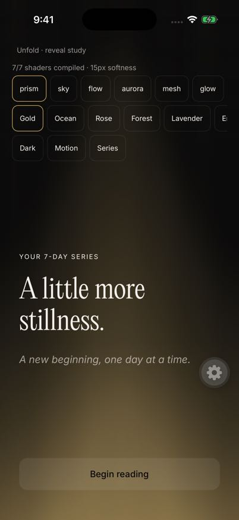

# Reveal gradients

The first devotional uses Sky when `DevotionalSegue.showReadyReveal` becomes true.
Series completion and day-one entrances use Prism.
Later days rotate deterministically through Flow, Mesh, Aurora, Glow, Bars, Sky, and Prism.
Forms is excluded.

Each field derives its colors from the current accent and background.
SkSL uses opaque sRGB `layout(color)` uniforms.
The render canvas uses half the view dimensions and scales its blur to at least 15 logical pixels.
The clock targets 30 updates per second.
It stops without focus, in the background, under Reduce Motion, and after unmount.
Reduced Motion shows a representative still frame.

Generation, storage, reveal eligibility, and navigation timing remain unchanged.
The visual change has no audio dependency.

## Source checks

- TypeScript passed.
- Twelve focused Jest suites passed, with 80 tests.
- ESLint found no errors. Five existing warnings remain in generating and DevotionalSegue.
- All seven effects compiled in a real CanvasKit SkSL runtime.
- The orchestrator and release coordinator completed their simplify reviews.

## Native evidence

FlowDeck built and launched the signed Debug app on iPhone 17 Pro, iOS 26.5.
The existing encrypted QA state opened successfully.
The native preview compiled all seven shaders.

The first two build attempts exposed missing generated SQLite headers and stale Clang modules.
Pod preparation and a fresh, task-owned DerivedData directory resolved those failures.
Pod versions did not change.
Two local podspec checksums differ only because they contain absolute checkout paths.
Those checksum changes are excluded from this change.

## Remaining merge gates

The native appearance, motion, and performance pass is still in progress.
It must cover every family, purple and green accents, light and dark themes, and live Reduce Motion.
It must also cover the actual first, series, and daily entrances.
Simulator results cannot establish physical-device energy cost.

The guarded preview is available in development builds at:

`unfold://dev/reveal-gradients?variant=prism&accent=gold&theme=dark`

The preview changes only local display state. It does not seed or replace account data.
