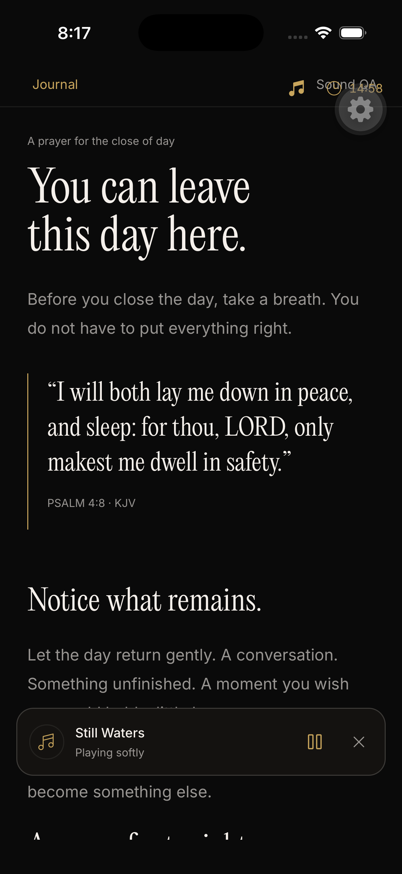
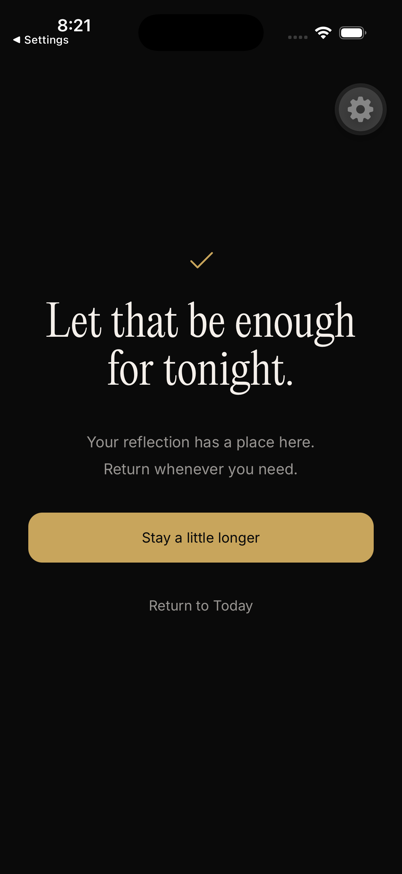
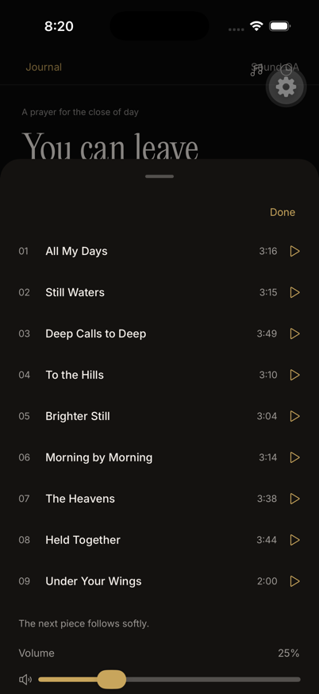
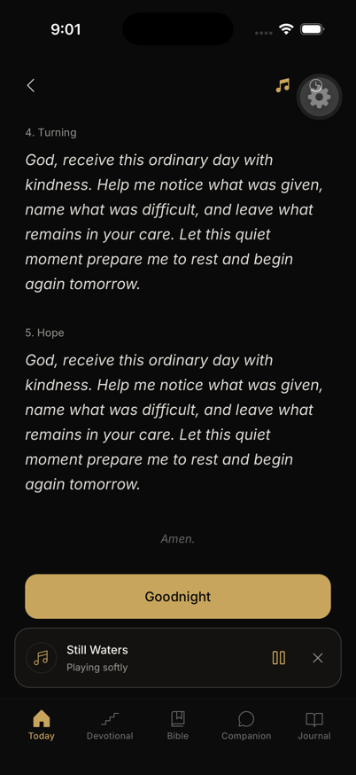
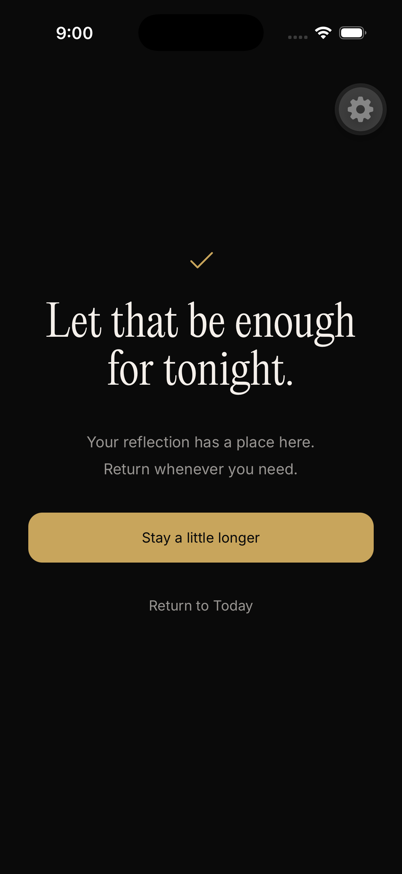
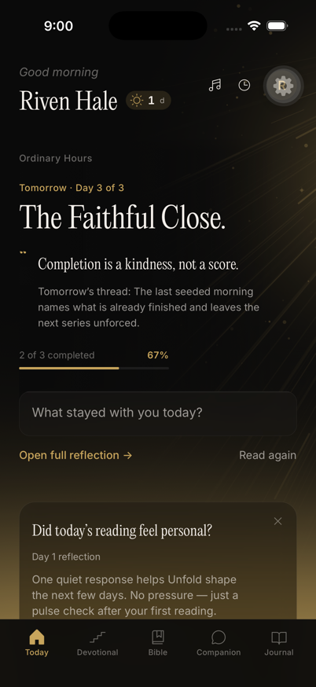
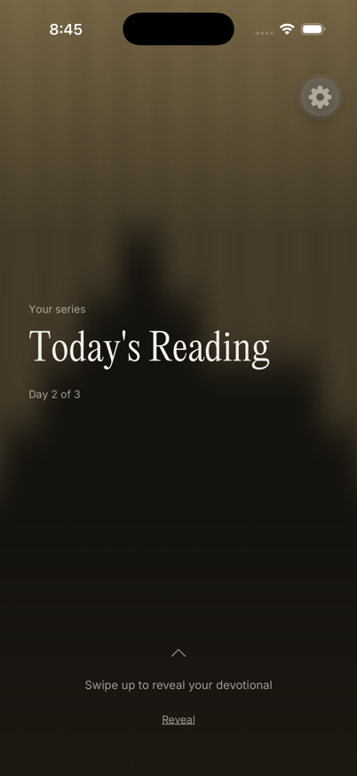

# Ambient sound acceptance — September 14, 2026

This change adds nine piano recordings, remembered sound choices, a sleep timer, and a quiet evening ending. Every visit begins silently. All four success cues have owner approval. The audio assets retain their approved bytes.

Sound uses one audio session registry. Narration and voice capture take priority. Backgrounding, interruptions, headphone removal, and media reset cancel pending cues. System callbacks do not resume a recorder. A manual action must start capture again. A consumed voice draft cannot recover during a later background event.

The visible playing bar reports its measured height. Today, evening, Journal, and Bible add that height to their existing scroll clearance. This keeps final actions reachable with music active and larger text.

The music and timer sheets now bind their animated position to a visible native view. Native checks cover opening, reopening, dismissal, dragging, and Reduce Motion.

## Source and checks

The source manifest identifies all 93 changed files over main `92d458b3efe8d68252636e97db23c0f08a180f9a`. That base includes PRs #128 and #129. Their reveal gradients, progress state, reflection motion, and completion navigation remain integrated.

The complete Jest run passed 454 suites and 3,915 tests. One existing live smoke suite and test remained skipped. Typecheck, lint, profiles, and Maestro selectors passed. Lint reported zero errors and 3,793 warnings.

The root simplify pass removed two test fallbacks from production focus hooks. Nine affected suites and 61 tests passed afterward. Typecheck and lint also passed again. The earlier full-suite proof remains valid for unchanged inputs. See [checks.json](checks.json). The later six-file clearance correction passed eight affected suites and 48 tests. Typecheck and scoped lint passed with zero errors and 25 existing warnings. See [clearance checks](clearance-checks.json).

## Native evidence

The patched simulator runtime uses byte-identical package, lockfile, patch, and Swift sources. See [runtime provenance](native-runtime-provenance.json).

The music sheet exposes all nine recordings. Play, pause, resume, track selection, timer countdown, and quiet ending passed. The fifteen-minute expiry uses regression proof. Native testing did not wait for the full duration.

The real native cue engine loaded and played all four approved assets. Playback time advanced. Backgrounding and a higher-priority voice review removed the active player. Neither cancellation restarted playback during its observation window. See [cue engine receipt](cue-engine-receipt.json).

That engine probe used production dependencies through the real cue owner. It used temporary instrumentation. Public emitter tests separately cover all four events, deduplication, and cancellation. The temporary route and previous cue ledger were restored.

Combined navigation passed on the composed source. Today opens reading music controls. Completion returns to Today and preserves progress. The day-two reveal renders its gradient. With music playing, Goodnight remains above the dock at maximum scroll. Quiet ending returns to real Today with 2/3 progress and sound off. Music opens again afterward. See [combined receipt](combined-native-receipt.json).

The evening route used a separate synthetic API fixture. The debug Tools overlay intercepted one header tap. Retesting outside its hit area confirmed the music sheet works. No production fix was needed for that development obstruction.

## Limits

Simulator proof does not establish acoustic quality, physical silent-switch behavior, phone-call interruption behavior, or microphone recovery on hardware. Those checks remain for physical-device acceptance. No archive, upload, or App Store submission forms part of this source proof.

