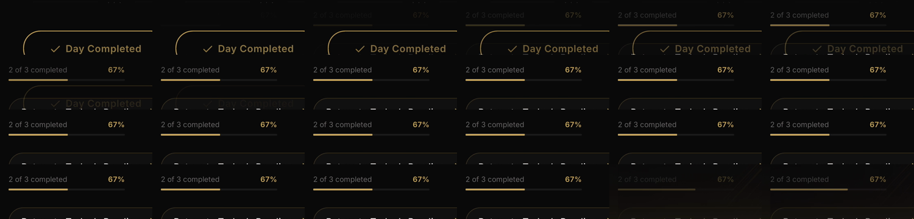
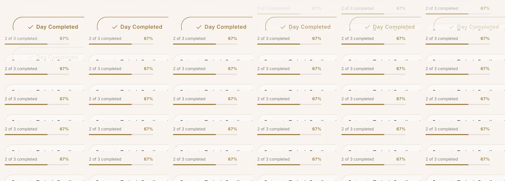

# Meaningful motion native acceptance

Validated retained progress on iOS26.5 with the installed native development client and current Metro source. Completing day2 and returning Home animates progress from33% to67%. System Reduce Motion displays67% immediately. A cold launch displays cached progress immediately. Progress history resets on identity, series, and full reset. Completion navigation is unchanged.

The preparing state became ready automatically after an8second fixture response. The ready action remained usable. Existing reflection, voice, and breath proof remains valid because its18 source and test hashes match. Fixtures and incidental Podfile.lock changes are excluded.

Validation:437 suites passed with3808 tests. One suite and one test were skipped. The serial run with open-handle detection exited normally. TypeScript passed. Full lint, profile safety, and Maestro selector checks passed. Existing lint warnings remain.

The evidence uses a simulator and synthetic service responses. It does not establish physical-device performance, GPU timing, production generation quality, or a signed Release binary. Settled background recovery passed. Background interruption during the ready transition was not recaptured.
