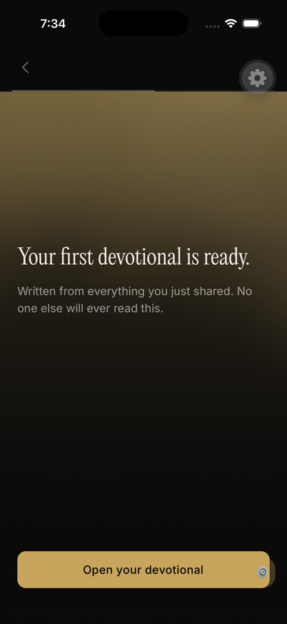
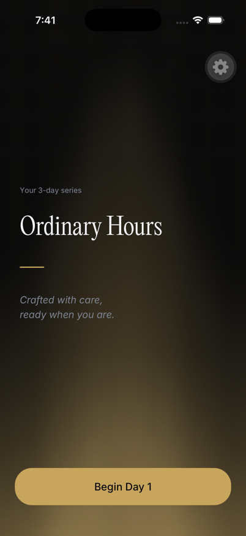
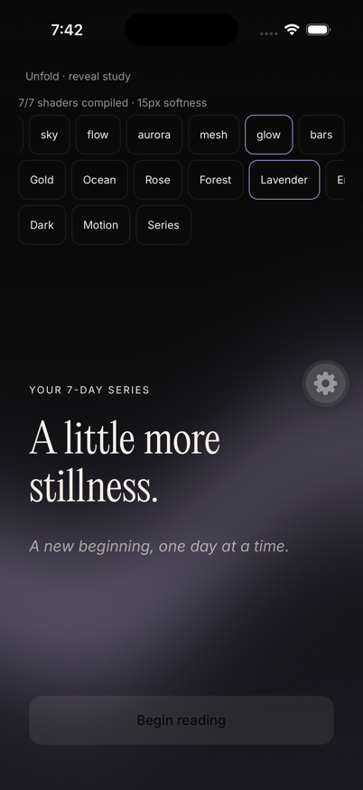
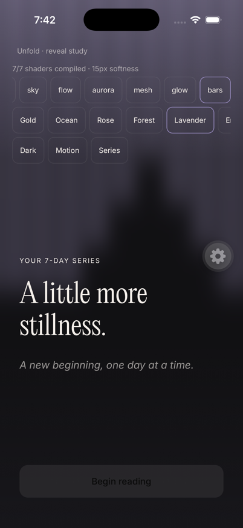

# Reveal gradient native acceptance

Validated the unchanged69681d4 source on an iOS26.5 simulator. All seven native shader families compiled and displayed. Forms is excluded. The field has15logical pixels of softening and follows the accent. Purple and green appearances passed in light and dark themes.

Actual onboarding used Sky. New series and day1 used Prism. A later day used the stored deterministic rotation and displayed Bars. Existing rotation tests cover all seven families.

System Reduce Motion produced33 identical sampled field frames. Disabling it produced85 unique frames among87 sampled frames. After reading unmounted the field,36 sampled frames stayed identical. Native focus and background recovery passed. Existing renderer tests establish hidden-clock disable and cleanup.

Validation remains valid for unchanged source:80 tests across12 suites passed. TypeScript passed. Lint reported0 errors and5 existing warnings.

This evidence uses a native development client and synthetic service responses. Sampled frames establish visible motion and stillness. They do not measure GPU frame time, dropped frames, idle CPU, device energy, or a signed Release build.
